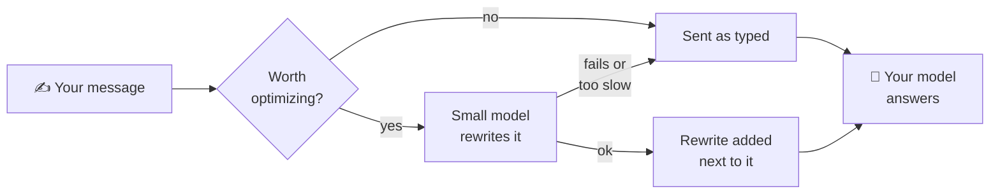

<div align="center">


# hermes-prompt-optimizer

**Sharper prompts in, better answers out.**

A small, fast model rewrites each message you send into a clear prompt,<br>
tuned for the model that answers. You type the way you always do.

[](https://github.com/NousResearch/hermes-agent)
[](LICENSE)
[](#requirements)

[Quick start](#quick-start) · [How it works](#how-it-works) · [Configure](#configure) · [Troubleshooting](#troubleshooting)


</div>

## Why

You type fast. The prompt the model gets is only as clear as your message. This plugin puts a
small model between you and your Hermes model to turn quick messages into clear, well-structured
prompts. Nothing about how you chat has to change.

- **Tuned per model.** Claude, GPT and Gemini each get a prompt shaped by their vendor's
  prompting guide.
- **Cheap and fast.** Use a small local model (Ollama, LM Studio) or any provider Hermes supports.
- **Your words stay yours.** The chat shows exactly what you typed. The rewrite is added next
  to your message, never swapped in, and your message wins if the two conflict.
- **Fails safe.** If anything goes wrong or takes too long, your message is sent exactly as typed.
- **Best of N.** Set `rounds: 3` to write three rewrites in parallel and let a judge pick the best.

## See it in action

A real run: `claude-sonnet-5` as the optimizer rewriting for `claude-opus-5-5`, with the stock
`config.yaml.example` prompts.

**You type:**

> the csv export broke after yesterdays refactor, dates come out as unix timestamps now instead of YYYY-MM-DD. fix it and add a test so it doesnt happen again, but dont touch the json export

**The classic CLI shows, above the answer:**

```text
✦ optimized prompt · claude-sonnet-5 · 1.8s
  │ <task>
  │ Fix a bug: the CSV export broke after yesterday's refactor — dates now come out as unix timestamps instead of YYYY-MM-DD format. Find the cause and fix it.
  │ </task>
  │
  │ <constraints>
  │ - Do not touch the JSON export — only the CSV export should be changed.
  │ - Add a test that covers this date formatting so the bug can't silently recur.
  │ </constraints>
```

Every detail survives: the refactor, both date formats, the test and the JSON constraint. The XML
tags come from the Claude-specific prompt. GPT and Gemini targets get prompts based on their own
vendors' guides. If the rewrite comes back identical to your message, nothing is added.

## Quick start

> [!IMPORTANT]
> Needs **Hermes Agent v0.20.1 or newer** and an optimizer model you can reach.
> The template points at a local Ollama server, so change `model:` to your own before use.

**1. Install and enable** (add `-p <profile>` for a named profile):

```bash
hermes plugins install cosminfuica/hermes-prompt-optimizer --enable
```

In the desktop app, go to Settings → Plugins → Install from Git, or open
`hermes://plugin/install?repo=cosminfuica/hermes-prompt-optimizer&enable=1`.

**2. Choose the optimizer model.** In the chat, type `/optimizer` and set it there (see
[In the chat](#in-the-chat-optimizer)), or edit
`$HERMES_HOME/plugins/hermes-prompt-optimizer/config.yaml`. For example, to use a model through
OpenRouter with the key Hermes already has:

```text
/optimizer model.provider openrouter
/optimizer model.model google/gemini-2.5-flash
/optimizer model.base_url ""
```

or, in `config.yaml`:

```yaml
model:
  provider: openrouter             # any provider Hermes is signed in to
  model: google/gemini-2.5-flash   # a small, fast model keeps the wait short
  base_url: ""                     # empty: use `provider` above
  api_key_env: ""                  # empty: use the credentials Hermes already has
```

**3. Chat.** Start `hermes` and send a message of at least 12 characters. The
`✦ optimized prompt` block appears above the answer, and `/optimized` shows the last result at any
time.

> [!TIP]
> In the desktop app, enable **Prompt Optimizer** under Settings → Plugins to get a banner above
> the composer. The desktop half of a plugin is opt-in.

<details>
<summary><b>More install options</b>: pinning a commit, other optimizer plugins, verifying</summary>

<br>

- **Reproducible install:** pin a commit with `--ref <40-character commit SHA>`.
- **What the installer does:** Hermes clones the repo into
  `$HERMES_HOME/plugins/hermes-prompt-optimizer/`, runs its security scan, creates `config.yaml`
  from `config.yaml.example` and prints the next steps.
- **Another prompt optimizer enabled?** Disable it (for example a third-party
  `prompt-optimizer`), or every message gets rewritten twice:

  ```bash
  hermes plugins disable prompt-optimizer
  ```

- **Check it loaded:** `hermes plugins list` should show it enabled.

</details>

## Where you see it

| Surface                | How                                                                                                                         |
| ---------------------- | --------------------------------------------------------------------------------------------------------------------------- |
| Classic CLI (`hermes`) | A `✦ optimized prompt · <model> · <seconds>s` block above the answer. It goes to stderr, so `hermes chat -q` output stays clean. |
| Desktop app            | A banner above the composer, `✦ Optimized · <model> · 2.7s`, with the first line inline. Expand it, copy it or dismiss it.   |
| CLI, TUI, desktop      | `/optimized` shows the last result for this chat. `/optimized <session_id>` shows it for a specific chat.                    |

Toggle the CLI block with `show_in_cli`. `/optimized` is disabled in the messaging gateway
(Telegram, Discord, …) because Hermes doesn't tell plugin commands who is asking, so it could show
another user's prompt. Messages on those platforms are still optimized, just without a banner.

## How it works



1. You send a message. Hermes fires the plugin's `pre_llm_call` hook once per user turn.
2. The plugin decides whether to optimize it (see [Never optimized](#never-optimized)). If not,
   nothing happens.
3. It sends your message, plus the last `context_messages` chat turns (so "fix it" and "that file"
   resolve correctly), to the optimizer model. The system prompt is picked for the answering model:
   `prompts.per_model` has Claude, GPT and Gemini variants based on each vendor's prompting guide,
   with `prompts.default` as the fallback.
4. `rounds: 1` uses that single rewrite. `rounds: N` runs N calls in parallel, then a judge call
   (optionally a different model, `judge_model`) picks the best candidate.
5. The result is appended to the **API copy** of your message inside an `<optimized_prompt>` block,
   with a note telling the model to treat it as the task spec and to let your original message win
   on conflicts. The transcript keeps what you typed, and the bytes actually sent are stored
   alongside, so prompt caching and session resume keep working.
6. The attempt is recorded (last 10 per chat) under
   `$HERMES_HOME/plugin-data/hermes-prompt-optimizer/sessions/`, which feeds the banner and
   `/optimized`.

**Failure is safe.** If anything fails (endpoint down, bad key, timeout, output truncated at
`max_tokens`), your message is sent exactly as typed and the error is recorded. If Hermes' client
silently falls back to your main model because the optimizer endpoint is unreachable, the plugin
treats that as a failure too, so the main (paid) model never does the rewrite.

> [!NOTE]
> **Time budget.** Hermes gives a `pre_llm_call` hook `plugins.hook_callback_timeout` seconds
> (default 30). The whole optimization, judge included, stops 1.5 s before that limit. If it can't
> finish, the original message goes through. For `rounds > 1` or a slow optimizer model, raise
> the limit:
>
> ```bash
> hermes config set plugins.hook_callback_timeout 90
> ```

### Never optimized

- Messages shorter than `min_chars` or longer than `max_chars`
- Images and other non-text messages, and slash commands
- Turns Hermes writes itself (auto-continue, background-process and kanban notices, model switches)
- Subagents, background review and `/btw` forks, cron jobs and kanban workers

### Known limits

- `pre_llm_call` can only _add_ context. The main model sees your original message **and** the
  optimized block, because Hermes has no hook that replaces only the API copy.
- With `api_mode: codex_app_server`, Hermes drops hook context, so the plugin has no effect there.
- The desktop banner asks the active gateway only, so a chat owned by another profile shows no
  banner.

## Requirements

- **Hermes Agent v0.20.1 or newer.** Models are called through Hermes' own client stack
  (`call_llm`), so every provider, custom endpoint and credential pool Hermes knows about works.
  v0.20.1 added the `route_info` the plugin uses to catch a silent fallback to your main model.
- **An optimizer model you can reach.** The template points at a local Ollama server
  (`qwen2.5:7b` on `http://127.0.0.1:11434/v1`), so **change `model:` to your own before use.**
- **No extra Python packages.** It only needs `pyyaml` and `ruamel.yaml`, which are already in
  Hermes' venv.

## Configure

Settings live in `config.yaml` inside the installed plugin folder, created from
`config.yaml.example` on install. Change them from the chat with `/optimizer`, or edit the file.
Both change the same file, and a change applies to your next message, with no restart.

The two settings most people change:

```yaml
model:
  provider: ""
  model: qwen2.5:7b                   # your optimizer model
  base_url: http://127.0.0.1:11434/v1 # e.g. a local Ollama server; "" to use `provider`
  api_key_env: ""

rounds: 1                             # 3 = three rewrites in parallel + a judge picks the best
```

### In the chat: `/optimizer`

Type `/optimizer` in the classic CLI, the TUI or the desktop app. It lists every setting with a
number and its current value. Change one with `/optimizer <number or key> <value>`.

| Command                                                     | What it does                                                               |
| ----------------------------------------------------------- | -------------------------------------------------------------------------- |
| `/optimizer` (or `/optimizer show`)                         | Every setting, numbered, with its current value and what it does            |
| `/optimizer <number or key>`                                | One setting: what it does, allowed values, default, ready-to-type commands  |
| `/optimizer <number or key> <value>`, or `/optimizer set …` | Check the value, save it, reply `old → new`                                 |
| `/optimizer on` / `/optimizer off`                          | Turn the optimizer on or off                                                |
| `/optimizer reset <number or key>`                          | One setting back to its default                                             |
| `/optimizer reset`                                          | Preview: what `reset all` would change. Nothing is saved                    |
| `/optimizer reset all`                                      | Every setting back to its default, except the prompts                       |
| `/optimizer help`                                           | Usage, and the path of the settings file                                    |

- `""` is an empty value: `/optimizer model.base_url ""` switches from an endpoint to `model.provider`.
- True/false settings also take `on`/`off` and `yes`/`no`.
- An invalid value is refused with what's allowed, and nothing is saved. A mistyped key gets a
  "Did you mean …?" when a setting's name is close.
- A save rewrites only that setting: your comments and the rest of the file stay as they were.
- The prompts (`prompts.*`) are multi-line text, so they are edited in `config.yaml` only.
- After setting `api_key_env` to a variable you just added to Hermes' `.env`, run `/reload` or
  restart Hermes so it sees the new variable. The reply reminds you when the variable isn't set.
- On messaging platforms (Telegram, Discord, …) the command only replies that it isn't available
  there: Hermes doesn't tell plugin commands who is asking, so anyone in a group chat could change
  your settings.

<details>
<summary><b>Example session</b></summary>

<br>

```text
> /optimizer
Prompt optimizer: on
Settings file: /home/you/.hermes/plugins/hermes-prompt-optimizer/config.yaml

  1. enabled = true — Master switch
  2. rounds = 1 — Optimized candidates per message

  3. model.provider = "" — Hermes provider (openrouter, anthropic, custom:<name>, …)
  4. model.model = "qwen2.5:7b" — Model name
  …
 20. show_in_cli = true — Print the optimized prompt in the classic CLI

Change: /optimizer <number or key> <value>, e.g. /optimizer 2 3
Details and choices: /optimizer <number or key> · Reset: /optimizer reset [key] · Help: /optimizer help
Prompts (prompts.*) are multi-line: edit them in the settings file.

> /optimizer 2
2. rounds = 1
  Optimized candidates per message; above 1, a judge call picks the best.
  Allowed: a whole number from 1 to 5. Default: 1.
  Choose: /optimizer rounds 1 · /optimizer rounds 2 · /optimizer rounds 3 · /optimizer rounds 4 · /optimizer rounds 5
  Reset: /optimizer reset rounds

> /optimizer 2 3
Saved rounds: 1 → 3. Applies from your next message, no restart needed.
Note: a run can take up to 40s, but Hermes allows plugins 30s. Raise the limit: hermes config set plugins.hook_callback_timeout 50

> /optimizer rounds 9
Not saved: rounds must be a whole number from 1 to 5.
  Choose: /optimizer rounds 1 · /optimizer rounds 2 · /optimizer rounds 3 · /optimizer rounds 4 · /optimizer rounds 5

> /optimizer modle.model llama3
Unknown setting "modle.model". Did you mean model.model? Type /optimizer for the list.

> /optimizer off
Saved enabled: true → false. Applies from your next message, no restart needed.
The optimizer is off: messages are sent as typed. Turn it back on: /optimizer on

> /optimizer reset
/optimizer reset all would change:
  enabled: false → true
  rounds: 3 → 1
Type /optimizer reset all to confirm (prompts are not touched), or /optimizer reset <key> for one.
```

</details>

### Editing `config.yaml` by hand

Editing the file directly still works, and it is the only way to change the prompts. The plugin
re-reads it when it changes, so a hand edit applies to your next message too, and `/optimizer`
shows it right away. Invalid values fall back to defaults with a warning in the log instead of
breaking your chat. If the file can't be parsed at all, messages are sent as typed until you fix
it; `/optimizer` names the line with the error and won't save over the file.

<details>
<summary><b>All settings</b></summary>

<br>

The number is the one `/optimizer` shows. The default is the value in `config.yaml.example`,
which `/optimizer reset` puts back.

| #     | Key                                            | Default                     | What it does                                                                                                                                                                         |
| ----- | ---------------------------------------------- | --------------------------- | ------------------------------------------------------------------------------------------------------------------------------------------------------------------------------------ |
| 1     | `enabled`                                      | `true`                      | Master switch.                                                                                                                                                                       |
| 2     | `rounds`                                       | `1`                         | 1 = one optimizer call. 2 to 5 = that many parallel calls + 1 judge call that picks the best.                                                                                        |
| 3     | `model.provider`                               | `""`                        | Any Hermes provider (`openrouter`, `anthropic`, `nous`, `custom:<name>`, …). Empty = your main provider. Ignored when `base_url` is set.                                             |
| 4     | `model.model`                                  | `qwen2.5:7b`                | Optimizer model name. Change it to a model you can reach.                                                                                                                            |
| 5     | `model.base_url`                               | `http://127.0.0.1:11434/v1` | Any OpenAI-compatible endpoint (vLLM, Ollama, LM Studio, a proxy, …); empty = use `provider`. If it matches one of your `custom_providers`, that entry and its key are reused.        |
| 6     | `model.api_key_env`                            | `""`                        | The _name_ of an env var holding the key. Put the secret in `~/.hermes/.env`, never in this file. Empty with a `base_url` that isn't a custom provider = no key is sent.             |
| 7     | `model.temperature`                            | `0.5`                       | Sampling temperature, 0 to 2.                                                                                                                                                        |
| 8     | `model.max_tokens`                             | `1500`                      | Output token limit per call, 64 to 32768.                                                                                                                                            |
| 9     | `model.timeout`                                | `20`                        | Seconds per call, 1 to 600, still bounded by the hook budget (see "Time budget" above).                                                                                              |
| 10–16 | `judge_model.provider` … `judge_model.timeout` | unset                       | Optional different model for the judge (`rounds` > 1), same keys as `model`. Each unset key uses the `model` value.                                                                  |
| 17    | `min_chars`                                    | `12`                        | Shorter messages are sent untouched (0 to 100000, lower than `max_chars`).                                                                                                           |
| 18    | `max_chars`                                    | `6000`                      | Longer messages are sent untouched (1 to 100000).                                                                                                                                    |
| 19    | `context_messages`                             | `4`                         | How many recent chat messages the optimizer sees, 0 to 20.                                                                                                                           |
| 20    | `show_in_cli`                                  | `true`                      | Print the optimized prompt in the classic CLI.                                                                                                                                       |
|       | `prompts.default`                              | see the file                | The optimizer's system prompt. `{target_model}` = the model that will answer. File only.                                                                                             |
|       | `prompts.per_model`                            | Claude, GPT, Gemini         | Comma-separated globs → prompt, matched case-insensitively against the answering model (`"*claude*, anthropic/*"`). First match wins. `{base}` inserts the default prompt. File only. |
|       | `prompts.judge`                                | see the file                | The judge's system prompt. File only.                                                                                                                                                |

</details>

<details>
<summary><b>Examples</b>: OpenRouter, a local Ollama server</summary>

<br>

A model through OpenRouter, with the key Hermes already has:

```yaml
model:
  provider: openrouter
  model: google/gemini-2.5-flash
  base_url: ""
  api_key_env: ""
```

A local Ollama server:

```yaml
model:
  provider: ""
  model: qwen2.5:7b
  base_url: http://127.0.0.1:11434/v1
  api_key_env: ""
```

</details>

## Update and uninstall

- **Update:** `hermes plugins update hermes-prompt-optimizer`. Your `config.yaml` is kept. New keys
  in `config.yaml.example` fall back to built-in defaults until you copy them over.
- **Reinstall:** `hermes plugins install cosminfuica/hermes-prompt-optimizer --force` replaces the
  whole folder, `config.yaml` included, so copy your `config.yaml` somewhere else first.
- **Disable:** `hermes plugins disable hermes-prompt-optimizer`
- **Remove:** `hermes plugins remove hermes-prompt-optimizer`, and also delete
  `$HERMES_HOME/plugin-data/hermes-prompt-optimizer/` if you want the history gone.

## Troubleshooting

<details>
<summary><b>Nothing happens</b></summary>

<br>

Check that `hermes plugins list` shows it enabled in the profile you're chatting with, that the
message is at least `min_chars` long, and that the optimizer is on (`/optimizer` shows it on the
first line). `/optimized` shows the last status and error.

</details>

<details>
<summary><b><code>/optimized</code> says "sent as typed (error: …)"</b></summary>

<br>

The optimizer endpoint, model name or key is wrong. The error text says which. Test the endpoint
directly with `curl <base_url>/models`.

</details>

<details>
<summary><b><code>/optimized</code> says "sent as typed (late)", or time-budget errors</b></summary>

<br>

Raise `plugins.hook_callback_timeout`, lower `rounds`, or use a faster optimizer model.

</details>

<details>
<summary><b>Every message is rewritten twice</b></summary>

<br>

Another optimizer plugin is enabled. Disable it with `hermes plugins disable <its-name>`, for
example `hermes plugins disable prompt-optimizer`.

</details>

## Development

<details>
<summary><b>Project layout</b></summary>

<br>

```text
hermes-prompt-optimizer/
├── plugin.yaml              manifest: name, version, the pre_llm_call hook
├── __init__.py              register(): wires the hook, /optimized and /optimizer into Hermes
├── config.yaml.example      settings template, copied to config.yaml on install
├── after-install.md         next steps printed by `hermes plugins install`
├── optimizer/               the Python half
│   ├── config.py            config.yaml loading, per-model prompt pick
│   ├── engine.py            parallel optimizer calls + the judge
│   ├── history.py           recent results per chat (read by /optimized and the banner)
│   ├── hook.py              the pre_llm_call hook, skip rules, /optimized
│   ├── settings.py          validated read/update/save of config.yaml (keeps comments)
│   └── command.py           /optimizer: view and change the settings from the chat
├── desktop/
│   └── plugin.js            the desktop half: banner above the composer (optional)
├── assets/                  logo, pictures and the social preview image
├── .github/workflows/       CI: the self-checks on the oldest and a current Hermes release
└── tests/
    ├── test_optimizer.py    self-check, no network
    ├── test_settings.py     self-check of settings.py, no network
    ├── test_command.py      self-check of the /optimizer command, no network
    └── test_integration.py  /optimizer through Hermes' own loader, command dispatch and hook
```

The top-level files are where Hermes looks for them: `plugin.yaml` and `__init__.py` to load the
plugin, `after-install.md` and `*.example` on install, and `desktop/plugin.js` for the desktop half.

</details>

The self-checks use fake model calls and a temporary `HERMES_HOME`, so they touch no real data:

```bash
git clone https://github.com/cosminfuica/hermes-prompt-optimizer && cd hermes-prompt-optimizer
~/.hermes/hermes-agent/venv/bin/python tests/test_optimizer.py     # prints "ok: all self-checks passed"
~/.hermes/hermes-agent/venv/bin/python tests/test_settings.py      # prints "ok: all settings self-checks passed"
~/.hermes/hermes-agent/venv/bin/python tests/test_command.py       # prints "ok: all command self-checks passed"
~/.hermes/hermes-agent/venv/bin/python tests/test_integration.py   # prints "ok: all integration checks passed"
hermes plugins doctor . --ci                                      # manifest, import and registration
```

The warnings printed during the self-checks are expected. They come from the bad-config and
failure cases they exercise. CI (`.github/workflows/tests.yml`) runs all four, plus
`plugins doctor`, on Hermes v0.20.1 (the oldest supported release) and v0.21.5.

## Contributing

Bug reports, prompt improvements and new per-model variants are welcome. Please
[open an issue](https://github.com/cosminfuica/hermes-prompt-optimizer/issues) or a pull request,
and run the self-checks before sending it.

<div align="center">

<br>


If this plugin makes your prompts better, **[give it a ⭐ on GitHub](https://github.com/cosminfuica/hermes-prompt-optimizer)** so other Hermes users can find it.

<sub>MIT licensed. See <a href="LICENSE">LICENSE</a>.</sub>

</div>
