<div align="center">
  <picture>
    <source media="(prefers-color-scheme: dark)" srcset=".github/readme/banner-dark.svg">
    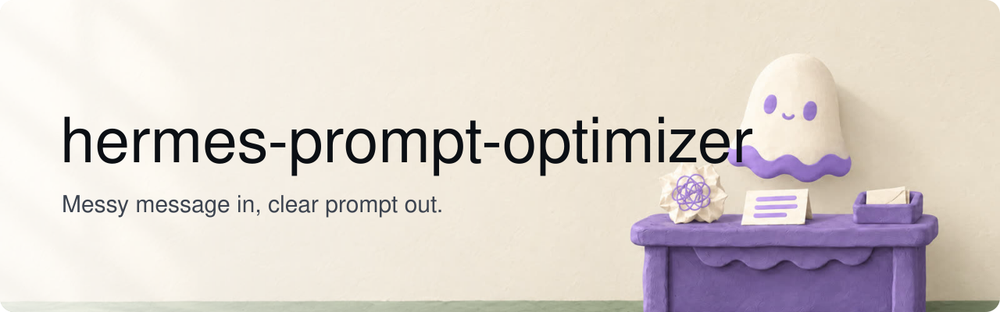
  </picture>

  <p>A Hermes Agent plugin for people who type fast. A small model rewrites each message into a clear prompt tuned for the model that answers. Your chat keeps exactly what you typed, and if the rewrite fails or runs late, your message is sent as typed.</p>

  <p>
    <a href="https://github.com/cosminfuica/hermes-prompt-optimizer/stargazers"></a>
    &nbsp;
    <a href="plugin.yaml"></a>
    &nbsp;
    <a href="LICENSE"></a>
    &nbsp;
    <a href="https://github.com/cosminfuica/hermes-prompt-optimizer/actions/workflows/tests.yml"></a>
  </p>

  <p>
    <a href="#quick-start"><picture><source media="(prefers-color-scheme: dark)" srcset=".github/readme/cta-start-dark.svg"></picture></a>
    &nbsp;
    <a href="https://github.com/user-attachments/assets/14944e57-ec38-4a20-9dad-3906395ed74e"><picture><source media="(prefers-color-scheme: dark)" srcset=".github/readme/cta-demo-dark.svg"></picture></a>
  </p>

  <p>
    <a href="#how-it-works"><b>How it works</b></a> &middot;
    <a href="#quick-start"><b>Quick start</b></a> &middot;
    <a href="#commands"><b>Commands</b></a> &middot;
    <a href="#configuration"><b>Configuration</b></a> &middot;
    <a href="#contributing"><b>Contributing</b></a>
  </p>

  https://github.com/user-attachments/assets/14944e57-ec38-4a20-9dad-3906395ed74e

  <p align="center">
    <picture><source media="(prefers-color-scheme: dark)" srcset=".github/readme/spec-1-dark.svg">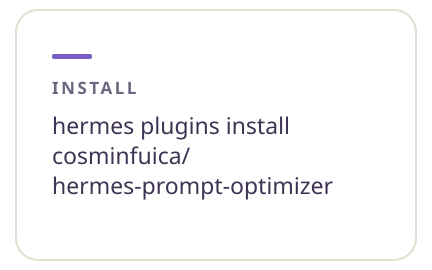</picture><picture><source media="(prefers-color-scheme: dark)" srcset=".github/readme/spec-2-dark.svg">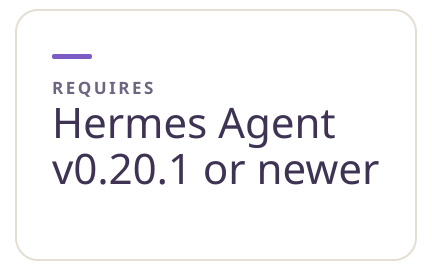</picture><picture><source media="(prefers-color-scheme: dark)" srcset=".github/readme/spec-3-dark.svg">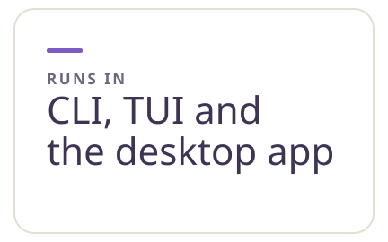</picture><picture><source media="(prefers-color-scheme: dark)" srcset=".github/readme/spec-4-dark.svg">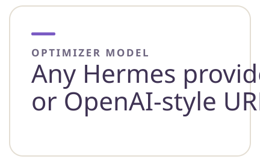</picture>
    <picture><source media="(prefers-color-scheme: dark)" srcset=".github/readme/spec-5-dark.svg">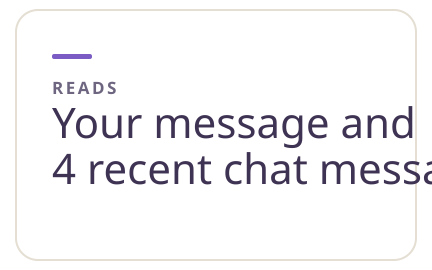</picture><picture><source media="(prefers-color-scheme: dark)" srcset=".github/readme/spec-6-dark.svg">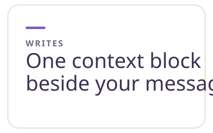</picture><picture><source media="(prefers-color-scheme: dark)" srcset=".github/readme/spec-7-dark.svg">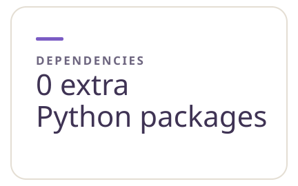</picture><picture><source media="(prefers-color-scheme: dark)" srcset=".github/readme/spec-8-dark.svg">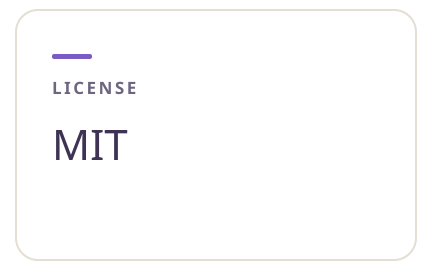</picture>
  </p>
</div>

<picture><source media="(prefers-color-scheme: dark)" srcset=".github/readme/rule-dark.svg"></picture>

<p align="center">
  <picture><source media="(prefers-color-scheme: dark)" srcset=".github/readme/tile-preview-dark.webp">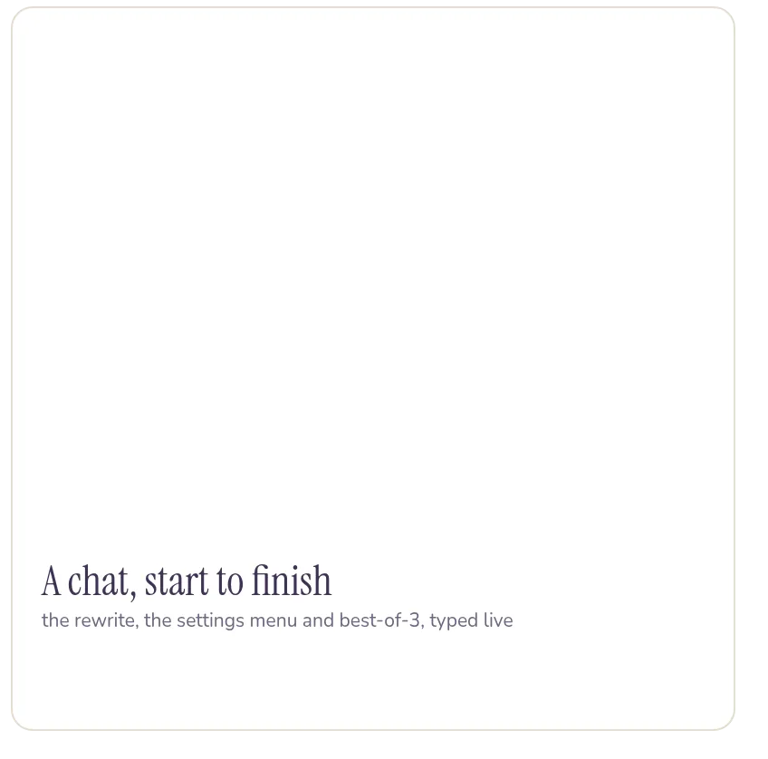</picture><picture><source media="(prefers-color-scheme: dark)" srcset=".github/readme/tile-stack-1-2-dark.webp">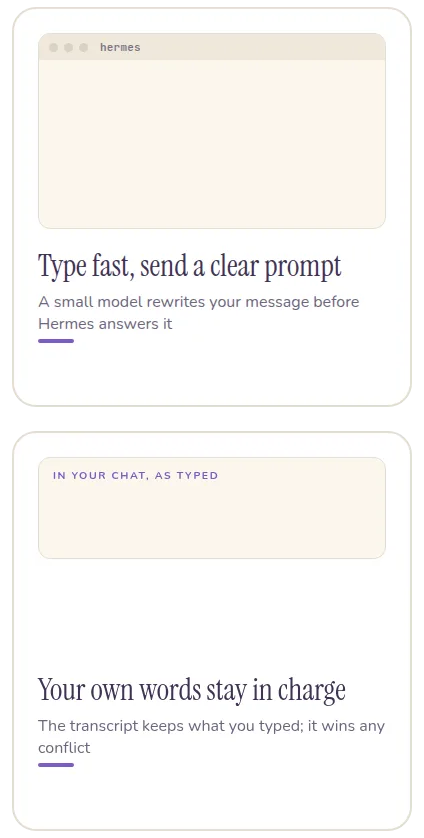</picture>
  <picture><source media="(prefers-color-scheme: dark)" srcset=".github/readme/tile-feature-3-dark.webp">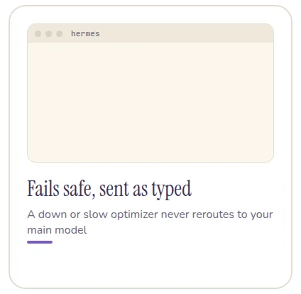</picture><picture><source media="(prefers-color-scheme: dark)" srcset=".github/readme/tile-feature-4-dark.webp">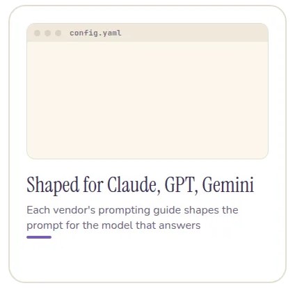</picture><picture><source media="(prefers-color-scheme: dark)" srcset=".github/readme/tile-feature-5-dark.webp">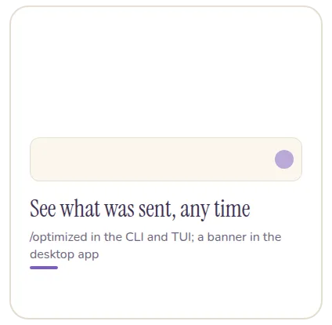</picture>
  <picture><source media="(prefers-color-scheme: dark)" srcset=".github/readme/tile-code-dark.webp">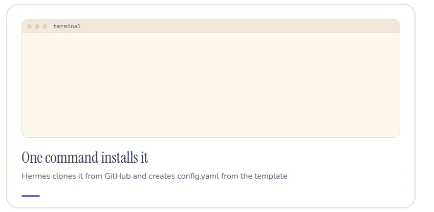</picture><picture><source media="(prefers-color-scheme: dark)" srcset=".github/readme/tile-list-dark.webp">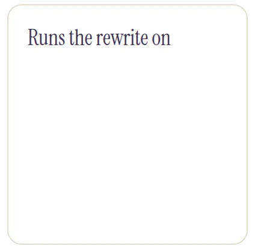</picture>
</p>

<picture><source media="(prefers-color-scheme: dark)" srcset=".github/readme/rule-dark.svg"></picture>

## How it works

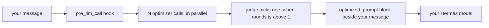
```mermaid
flowchart LR
  A[your message] --> B[pre_llm_call hook]
  B --> C[N optimizer calls, in parallel]
  C --> D[judge picks one, when rounds is above 1]
  D --> E[optimized_prompt block beside your message]
  E --> F[your Hermes model]
```

Hermes calls the plugin's `pre_llm_call` hook once per message. The hook can only add context, so the transcript keeps your words and the rewrite rides on the API copy of your message. Every model call goes through Hermes' own client, so each provider, custom endpoint and credential Hermes already knows works unchanged.

## Quick start

```console
$ hermes plugins install cosminfuica/hermes-prompt-optimizer --enable
$ hermes
> /optimizer model.base_url ""
Saved model.base_url: "http://127.0.0.1:11434/v1" → "". Applies from your next message, no restart needed.
> /optimizer model.provider openrouter
Saved model.provider: "" → "openrouter". Applies from your next message, no restart needed.
> /optimizer model.model google/gemini-2.5-flash
Saved model.model: "qwen2.5:7b" → "google/gemini-2.5-flash". Applies from your next message, no restart needed.
```

> [!TIP]
> Now send any message of 12 or more characters: the optimized prompt prints above the answer, and `/optimized` shows it again. Running Ollama locally? Skip the three settings: the template already points at `qwen2.5:7b` on `http://127.0.0.1:11434/v1`.

## Commands

| Command | What it does |
|---------|--------------|
| `/optimized` | Show the last optimized prompt for this chat, or why the message was sent as typed |
| `/optimizer` | List every setting, numbered, with its current value |
| `/optimizer <number or key> <value>` | Check and save one setting; it applies from your next message, no restart |
| `/optimizer <number or key>` | What a setting does, its allowed values, its default and ready-to-type choices |
| `/optimizer on`, `/optimizer off` | Turn the optimizer on or off |
| `/optimizer reset <number or key>` | Put one setting back to its default |
| `/optimizer reset all` | Put every setting except the prompts back to its default; `/optimizer reset` previews it |
| `/optimizer help` | Usage, and the path of the settings file |

```text
> /optimizer 2 3
Saved rounds: 1 → 3. Applies from your next message, no restart needed.
Note: a run can take up to 40s, but Hermes allows plugins 30s. Raise the limit: hermes config set plugins.hook_callback_timeout 50
> /optimizer modle.model llama3
Unknown setting "modle.model". Did you mean model.model? Type /optimizer for the list.
```

## Configuration

<details>
<summary><b>What do I need?</b></summary>

Hermes Agent v0.20.1 or newer (the desktop banner needs v0.20.2), and an optimizer model you can reach. No extra Python packages: `pyyaml` and `ruamel.yaml` already ship with Hermes. The settings template points at a local Ollama server (`qwen2.5:7b` on `http://127.0.0.1:11434/v1`), so change `model` to one you have before your first message.

</details>

<details>
<summary><b>Which model does the rewriting, and where do I set it?</b></summary>

Any provider Hermes is signed in to, or any OpenAI-compatible endpoint (Ollama, LM Studio, vLLM) through `base_url`. Set it with `/optimizer`, or in `config.yaml` inside the installed plugin folder (`$HERMES_HOME/plugins/hermes-prompt-optimizer/`):

```yaml
model:
  provider: openrouter             # any provider Hermes is signed in to
  model: google/gemini-2.5-flash   # a small, fast model keeps the wait short
  base_url: ""                     # empty: use `provider` above
  api_key_env: ""                  # empty: use the credentials Hermes already has
```

</details>

<details>
<summary><b>How does a rewrite reach my model?</b></summary>

Hermes calls the plugin's `pre_llm_call` hook once per message. The plugin sends your message and the last 4 chat messages (`context_messages`) to the optimizer, with a system prompt picked for the answering model (Claude, GPT and Gemini have their own). The result is appended to the API copy of your message; the transcript keeps what you typed. With `rounds` above 1, a judge picks the best of that many parallel rewrites. Messages under 12 characters, slash commands and images are left alone.

</details>

<details>
<summary><b>Where do I see what was sent?</b></summary>

In the classic CLI the optimized prompt prints above the answer, on stderr, so `hermes chat -q` output stays clean (`show_in_cli: false` turns it off). In the desktop app, enable Prompt Optimizer under Capabilities > Plugins (Settings > Plugins before v0.21.2) for a banner above the composer that you can expand, copy or dismiss. In the CLI, the TUI and the desktop app, `/optimized` shows the last result for the chat.

</details>

<details>
<summary><b>What happens when the optimizer is slow or down?</b></summary>

Your message is sent exactly as typed, and the error is recorded for `/optimized`. The whole run, judge included, stops 1.5 s before Hermes' `plugins.hook_callback_timeout` (30 s by default). For `rounds` above 1 or a slow model, raise it with `hermes config set plugins.hook_callback_timeout 90`. When the optimizer model can't be reached, the plugin stops Hermes from retrying the rewrite on your main model.

</details>

<details>
<summary><b>Can I install it from the desktop app, pin a version, or remove it?</b></summary>

- Desktop app (v0.20.5+): open `hermes://plugin/install?repo=cosminfuica/hermes-prompt-optimizer&enable=1` and leave "Desktop UI" ticked. The one exception: on desktop v0.20.5 to v0.21.1 with Hermes on the same machine, untick it, because the agent plugin already ships the banner.
- A named profile: add `-p <profile>`. A pinned commit: add `--ref <commit SHA>`.
- Update with `hermes plugins update hermes-prompt-optimizer`; your `config.yaml` is kept.
- Remove with `hermes plugins disable hermes-prompt-optimizer`, then `hermes plugins remove hermes-prompt-optimizer`.

</details>

<details>
<summary><b>What can't it do yet?</b></summary>

A `pre_llm_call` hook can only add context, so your main model sees your original message and the optimized block side by side. With `api_mode: codex_app_server`, Hermes drops hook context and the plugin has no effect. On messaging platforms (Telegram, Discord) messages are still optimized, but `/optimized` and `/optimizer` only answer in the CLI, TUI and desktop app, because Hermes doesn't tell plugin commands who is asking.

</details>

## Contributing

```bash
git clone https://github.com/cosminfuica/hermes-prompt-optimizer && cd hermes-prompt-optimizer
git clone --depth 1 --branch v2026.9.24 https://github.com/NousResearch/hermes-agent ../hermes-agent   # Hermes v0.21.5
(cd ../hermes-agent && uv sync --locked)
for t in tests/test_*.py; do ../hermes-agent/.venv/bin/python "$t"; done
HERMES_HOME="$(mktemp -d)" ../hermes-agent/.venv/bin/hermes plugins doctor . --ci
npm install --prefix tests --no-save --no-package-lock react@19.2.7 react-dom@19.2.7 @tanstack/react-query@5.101.2 jsdom@29.1.1
node tests/test_desktop.mjs
```

Found a bug or want a feature? [Open an issue](https://github.com/cosminfuica/hermes-prompt-optimizer/issues). Pull requests are welcome too: CI runs these checks on Hermes v0.20.1, the oldest supported release, and on v0.21.5.

<picture><source media="(prefers-color-scheme: dark)" srcset=".github/readme/contribute-dark.svg">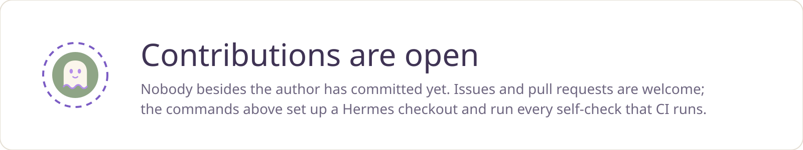</picture>

## License

MIT - see [LICENSE](LICENSE).

<div align="center">
  <picture>
    <source media="(prefers-color-scheme: dark)" srcset=".github/readme/outro-dark.svg">
    
  </picture>
  <p><a href="#readme">Back to top</a></p>
</div>
